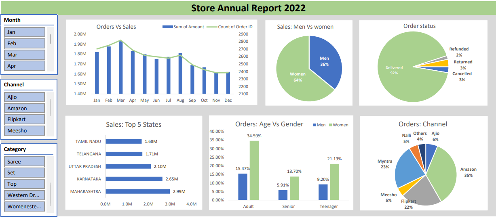

# Store-Analysis-Report-2022
## Project Objective:
Store wants to create an annual sales report for 2022. So that, Owner can understand their customers and grow more sales in the upcoming year.

## Problem Statements:
- Compare the sales and orders using single chart.
- Which month got the highest sales and orders?
- Who purchased more- men or women in 2022? What are different order status in 2022?
- List top 10 states contributing to the sales?
- Relation between age and gender based on number of orders
- Which channel is contributing to maximum sales?
- Highest selling category?, etc.

## Project Report:
 

  

## Insights:
- Women are more likely to buy compared to men (~65%)
- Maharashtra, Karnataka and Uttar Pradesh are the top 3 states (~35%)
- The adult age group (30-49 yrs) is max contributing (~50%)
- Amazon, Flipkart and Myntra channels are max contributing (~80%)

## Technical & Soft Skills:
- [x]	Proficiency in ETL methodology (Extract, Transform, Load).
- [x]	Skills to generate a date table using Power Query.
- [x]	Establishing data model relationships with Power Pivot.
- [x]	Proficiency in incorporating supplementary data into an existing data model.
- [x]	Utilizing DAX to create calculated columns.

## Soft Skills:
- [x]	Refined understanding of Sales Reports
- [x]	Designing user-centric reports with empathy in mind.
- [x]	Optimization of report generation through meticulous fine-tuning.
- [x]	Developing a systematic approach to devising a report-building plan.

